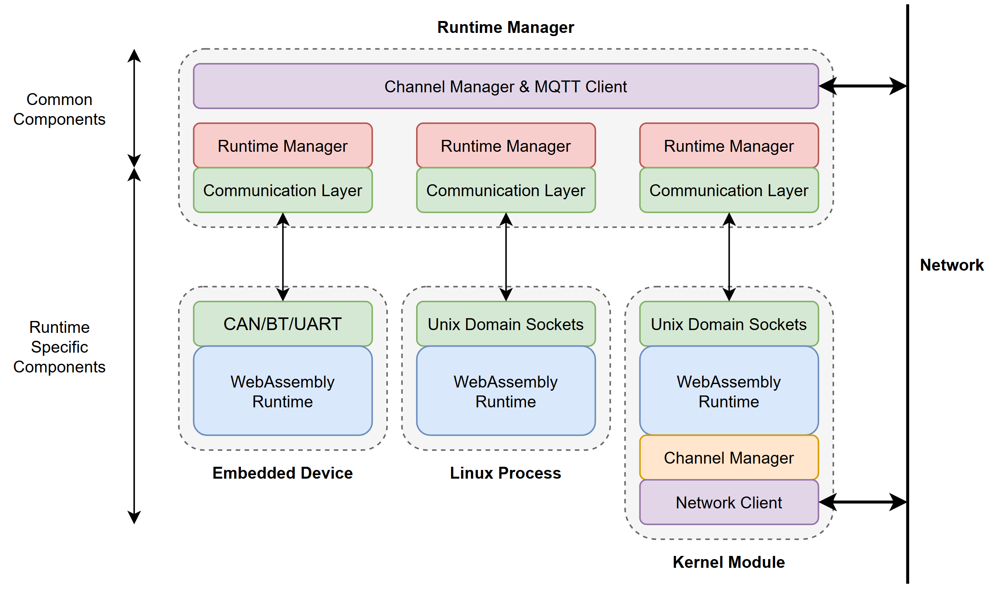

# Manager-based Runtime Refactor



## Usage

### Quick Setup
Ensure mosquitto is running. Then:
```sh
make env
make orchestrator
```

### Start Runtime
Start the runtime with
```sh
python start.py -n <name> -r <runtime ...>
```
where `<runtime>` is a list of runtimes you would like to start.

### Command Line Tools
Access tools (i.e. `run`) with
```sh
python manage.py <script> <args ...>
```
For example, to run a program:
```sh
python manage.py run -n test -f helloworld.wasm
```
Use `python manage.py -h` to list available scripts, and `python manage.py <script> -h` to get help for each script.

```
Available scripts:
    aot                 AOT compile WebAssembly sources for cluster devices.
    benchmark           Run (runtimes x files x engines) benchmarking.
    alias               Write cluster management aliases.
    cmd                 Execute command on cluster using SSH.
    configure           Create node/cluster configuration file.
    cpufreq             Set CPU frequency policy.
    get                 Copy file from cluster.
    index               Index executable benchmark files, excluding common files.
    list                List runtimes and modules running on each runtime.
    put                 Copy file to cluster.
    run                 Launch Silverline module(s).
    runall              Launch Silverline module(s) across cluster nodes.
    start               Start runtimes on cluster.
    status              List nodes and node status.
    stop                Stop Silverline module(s).
    shutdown            Shut down nodes.
    reboot              Reboot nodes.
    update              Update runtimes.
    kill                Stop runtimes on cluster.
    version             Get runtime version on each cluster node via commit hash.
```


## Logging & Naming Conventions

Messages are logged with the header `[time] [{module}:{LEVEL}] {message}`.
Modules include `mq` (MQTT/Channels), `mgr` (Node manager), `if` (Runtime interface), and `rt.{name}` (Runtime), where `name` indicates the originating runtime for that message.

**Table of Abbreviations:**

| Name / Module     | Abbreviation(s)            |
| ----------------- | -------------------------- |
| MQTT              | `mq`                       |
| Channels          | `ch`                       |
| Node Manager      | `mgr`                      |
| Runtime           | `rt`, `rt.{name}`          |
| Runtime Interface | `if`, `if.{name}`          |
| Critical          | `CRITICAL`, `CRI`, `L_CRI` |
| Error             | `ERROR`, `ERR`, `L_ERR`    |
| Warning           | `WARN`, `WRN`, `L_WRN`     |
| Info              | `INFO`, `INF`, `L_INF`     |
| Debug             | `DEBUG`, `DBG`, `L_DBG`    |

## Creating Runtimes

### Runtime Manager

Runtime interfaces should extend ```RuntimeManager```. Three methods need to be implemented:
```python
class RuntimeManager:
    # ...

    @abstractmethod
    def start(self) -> dict:
        """Start runtime, and return the registration config."""
        pass

    @abstractmethod
    def send(self, msg: Message) -> None:
        """Send message to runtime."""
        pass

    @abstractmethod
    def receive(self) -> Optional[Message]:
        """Poll interface and receive message; return None on timeout."""
        pass

    # ...
```

Then, set the runtime configuration:
```python
class RuntimeManager:
    # ...

    TYPE = "abstract"
    APIS = []
    MAX_NMODULES = 0

    # ...
```

- ```TYPE```: the ```runtime_type``` reported to the orchestrator, i.e. "linux/minimal".
- ```APIS```: available local APIs; exact specifications are **TODO**.
- ```MAX_NMODULES```: maximum number of modules supported; should usually be 128 for fully-featured runtimes, or 1 for minimum-viable-runtimes without multi-module support.

Optionally, runtime managers can also overwrite the ```create_module```, ```delete_module```, and ```cleanup_module``` methods to perform different/additional actions on create/delete/exit:

```python
class RuntimeManager:
    # ...

    def create_module(self, data: dict) -> None:
        """Create module; overwrite this method to add additional steps."""
        index = self.modules.insert(data)
        data["index"] = index
        self.send(Message.from_dict(
            Header.control | index, Header.create, data))

    def delete_module(self, module_id: str) -> None:
        """Delete module."""
        try:
            index = self.modules.get(module_id)
            self.send(Message(Header.control | index, Header.delete, bytes()))
        except KeyError:
            raise exceptions.ModuleException("Nonexisting module.", module_id)

    def cleanup_module(self, idx: int, mid: str, msg: Message) -> None:
        """Clean up module after exiting."""
        self.mgr.publish(
            self.control_topic("control"),
            self.mgr.control_message("exited", {
                "type": "module", "uuid": mid, **json.loads(msg.payload)}))
        self.mgr.channels.cleanup(self.index, idx)
        self.modules.remove(idx)

    # ...
```

###  Example

The ```linux/minimal``` runtime is the minimal code required to run WebAssembly modules and receive the output. The minimal linux runtime uses the ```SLSocket``` communication channel, with packet format:
```
[ -- len:2 -- ][h1:1][h2:1][ ------ payload:len ------ ]
```
The header has total size 4 bytes. Note that the length item in the header corresponds to the length of the payload portion, not the entire message.

See ```runtimes/linux_minimal.py``` (runtime-side) and ```manager/runtimes/linux_minimal.py``` (manager-side) for a minimal example.

## Messaging

The manager reads messages from MQTT, and parses them before passing on a corresponding message to the relevant runtime(s) if required. Each runtime is assumed to have its own communication channel, or communicate over a shared channel which can specify the runtime.

Messages have two header bytes (h1, h2), and are designed for arbitrary communication streams.
- The first byte indicates the module index `{m}` with the lower 7 bits, and whether the message is an ordinary channels message or a control message with the upper bit.

    **NOTE**: this creates a 128 modules per runtime limit, though this can be increased by increasing the header size.

- The second byte indicates an argument, which is the message type for control messages, and the channel index for channel messages.

    **NOTE**: This limits modules to opening 256 channels, which can again be increased through a larger header.

The following messages are currently specified:

| Sender  | Header    | Message          | Data         | Topic            |
| ------- | --------- | -----------------| ------------ | ---------------- |
| Manager | 1{m}.x00  | Create Module    | json         | .../control/{rt} |
| Manager | 1{m}.x01  | Delete Module    | null         | .../control/{rt} |
| Manager | 1{-}.x02  | Stop Runtime     | null         | .../control/{rt} |
| Manager | 0{m}.{fd} | Receive Message  | u8[]         | {topic}          |
| Runtime | 1{-}.x00  | Keepalive        | json         | .../control/{rt} |
| Runtime | 1{-}.x01  | Runtime Logging  | u8,char[]    | n/a              |
| Runtime | 1{m}.x02  | Module Exited    | json         | .../control/{rt} |
| Runtime | 1{m}.x03  | Open Channel     | u8,u8,char[] | n/a              |
| Runtime | 1{m}.x04  | Close Channel    | u8           | n/a              |
| Runtime | 1{m}.x05  | Module Logging   | u8,char[]    | n/a              |
| Runtime | 1{m}.x06  | Profiling Data   | char[]       | .../profile/...  |
| Runtime | 0{m}.{fd} | Publish Message  | u8[]         | {topic}          |


### Create Module

The create module message is encoded as a ```json```, which passes on fields sent by the orchestrator. Individual runtimes can overwrite ```RuntimeManager.create_module``` to encode messages differently.

From orchestrator:
```json
{
    "object_id": "fcb2780b-abdd-43b6-bc13-895baa2075a3",
    "action": "create",
    "type": "req",
    "data": {
        "type": "module",
        "uuid": "44c72c87-c4ec-4759-b587-30ddc8590f6b",
        "name": "test",
        ... other fields ...
    }
}
```

To runtime:
```json
{
    "index": 0,
    "uuid": "44c72c87-c4ec-4759-b587-30ddc8590f6b",
    "name": "test",
    ... other fields ...
}
```

Here, ``index`` indicates the module index to be used in the communication header. The ```other fields``` are provided by the orchestrator, and can vary per runtime.

### Delete Module

The delete module message has no payload; the index in the header specifies the target module.

### Stop Runtime

The stop runtime message has no payload or module index.

### Receive Message

Channel messages are passed without any encoding, i.e. passing the MQTT ```msg.payload``` directly as the payload.

### Keepalive

Runtimes can publish arbitrary JSON for keepalive messages:

```json
{
    "object_id": "50c2f088-a5b6-48c5-bbc7-4a693b0117a2",
    "action": "update",
    "type": "req",
    "data": {
        "type": "runtime",
        "uuid": "5f937916-d29d-4f66-801e-3d69f57728e2",
        "name": "rt1",
        "apis": ["wasi:unstable", "wasi:snapshot_preview1"],
        ... other fields ...
}
```

The ```other fields``` can be any JSON passed by the runtime; the keys inside the json (which must have a dict as the outer-most layer) are added to the ```data``` attribute.

### Runtime Logging

Runtime logging messages are forwarded to the manager's logger. The first byte indicates the logging level if the leading bit is set to 1; if the first byte has a leading bit 0 (i.e. a valid ASCII character), the message is logged as a whole.

```
| 1 | Level /7 | ---------- Message (char[]) ---------- |
```

Logging levels are specified according to [Python's convention](https://docs.python.org/3/library/logging.html#logging-levels). This allows logging messages to show up correctly alongside logging messages from the manager; for example,
```c
log_msg(L_ERR, "This is an error message.");
```
will show up alongside manager log messages:
```c
[13:43:28] [DBG:if.example] [x00.x80.x01] Received message.
[13:43:28] [ERR:rt.example] This is an error message.
```

Note that logged messages do not need to include a newline, since the manager's logging library automatically includes one.

### Module Exited

On module exit, any metadata (```other fields```) returned as a JSON is forwarded to the orchestrator:

```json
{
    "object_id": "fcb2780b-abdd-43b6-bc13-895baa2075b4",
    "action": "exited",
    "type": "req",
    "data": {
        "type": "module",
        "uuid": "44c72c87-c4ec-4759-b587-30ddc8590f6b",
        ... other fields ...
    }
}
```

### Open Channel

The open channel message is a binary format, with two header bytes:

```
| channel index | channel flags | ... topic name ... |
```

The channel index is an unsigned byte used to index the channel (the same as the header in publish and receive messages); the channel flags (bitwise) indicate the read/write mode, as well as MQTT QoS:

```python
read      = 0b0001
write     = 0b0010
readwrite = 0b0011

qos0      = 0b0000
qos1      = 0b0100
qos2      = 0b1000
```

### Close Channel

The close channel message takes a single argument - the channel index (unsigned byte).

### Module Logging

Module logging messages are currently handled identically to runtime logging messages.

### Profiling

Profiling messages are forwarded to ```{realm}/proc/profile/{profile_type}/{module_id}```. 

*Benchmarking* (```type=benchmarking```): only basic timing information in microseconds.
```
24b:   [utime /u32 ][stime /u32 ][maxrss /u32]
```

*Opcode Counting* (```type=opcodes```): WASM opcode counts in interpreted mode.
```
2048b: [ ------------- op_count /u64 x 256 -------------- ]
```

*Instrumented* (```type=instrumented```): Loop instrumentation counts.
```
4Nb:   [ ------------- loop_count /u32 x N -------------- ]
```

*Deployed Profiling* (```type=deployed```): timing, memory, and network information.
```
32b:   [ ----- start /u64 ----- ][ wall /u32 ][utime /u32 ]
       [stime /u32 ][maxrss /u32][ch_in /u32 ][ch_out /u32]
```

### Publish Message

Published messages are passed to their corresponding topic. Any runtimes with the same manager with channels subscribed to this topic also receive the published message as a loopback; the manager is configured as a gateway, so will not receive messages that it sends.

## Todos

- Add wasi dirs "dir" (list[str]) attribute to Create Module
- Add "status" (object) attribute to Module Exited

