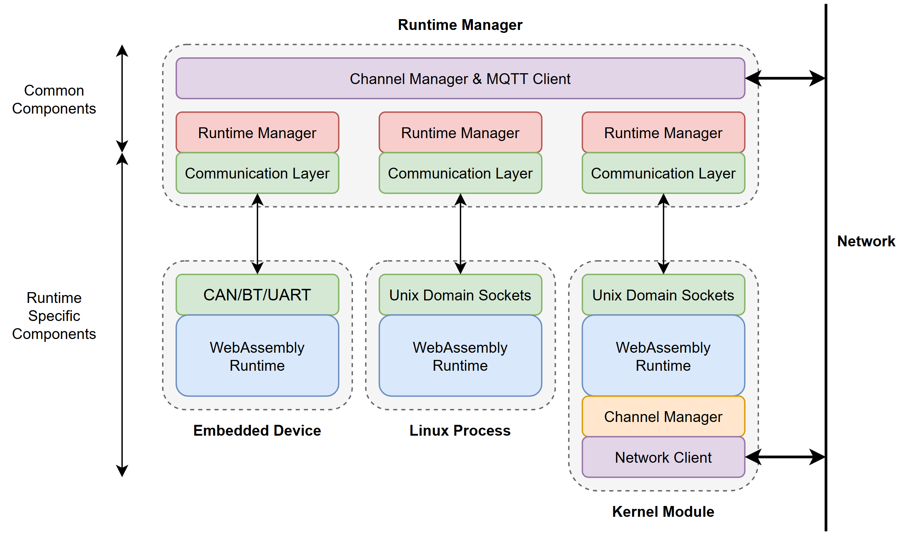

# Manager-based Runtime Refactor



Messaging documentation:
- For runtime manager - orchestrator messaging, see [orchestator messaging](docs/messaging.rst).
- For runtime - runtime manager messaging, see [runtime manager interface](docs/interface.md).

For a guide on creating runtimes, see [creating runtimes](docs/creating_runtimes.md).

## Usage

### Quick Setup
Ensure mosquitto is running. Then:
```sh
make env
make orchestrator
python start.py -n test -r linux/min/wasmer
```

### Build Runtimes
Runtimes that require compilation can be built with
```sh
make -C runtimes
```
Static type checking for the python components of the runtime manager can be run with
```sh
pip install -r requirements.txt
pip install -r requirements-dev.txt
make typecheck
```

### Start Runtime
Start the runtime with
```sh
python start.py -n <name> -r <runtime ...>
```
where `<runtime>` is a list of runtimes you would like to start.

### Command Line Tools
Access tools (i.e. `run`) with
```sh
python manage.py <script> <args ...>
```
For example, to run a program:
```sh
python manage.py run -n test -f helloworld.wasm
```
Use `python manage.py -h` to list available scripts, and `python manage.py <script> -h` to get help for each script.

```
Available scripts:
    aot                 AOT compile WebAssembly sources for cluster devices.
    benchmark           Run (runtimes x files x engines) benchmarking.
    alias               Write cluster management aliases.
    cmd                 Execute command on cluster using SSH.
    configure           Create node/cluster configuration file.
    cpufreq             Set CPU frequency policy.
    get                 Copy file from cluster.
    index               Index executable benchmark files, excluding common files.
    list                List runtimes and modules running on each runtime.
    put                 Copy file to cluster.
    run                 Launch Silverline module(s).
    runall              Launch Silverline module(s) across cluster nodes.
    start               Start runtimes on cluster.
    status              List nodes and node status.
    stop                Stop Silverline module(s).
    shutdown            Shut down nodes.
    reboot              Reboot nodes.
    update              Update runtimes.
    kill                Stop runtimes on cluster.
    version             Get runtime version on each cluster node via commit hash.
```

## Runtimes

Currently available runtimes:
- `linux`:
    - `linux/min/wasmer`: wasmer-based minimal runtime (stdout only).
    - `linux/min/wamr`: wamr-based minimal runtime (stdout only).
- `benchmarking`:
    - `benchmarking`: generic benchmarking runtime.
    - `benchmarking/opcodes`: opcode counting interpreted runtime.
    - `benchmarking/if`: simultaneous interference runtime.

## Logging & Naming Conventions

Messages are logged with the header `[time] [{module}:{LEVEL}] {message}`.
Modules include `mq` (MQTT/Channels), `mgr` (Node manager), `if` (Runtime interface), and `rt.{name}` (Runtime), where `name` indicates the originating runtime for that message.

**Table of Abbreviations:**

| Name / Module     | Abbreviation(s)            |
| ----------------- | -------------------------- |
| MQTT              | `mq`                       |
| Channels          | `ch`                       |
| Node Manager      | `mgr`                      |
| Runtime           | `rt`, `rt.{name}`          |
| Runtime Interface | `if`, `if.{name}`          |
| Critical          | `CRITICAL`, `CRI`, `L_CRI` |
| Error             | `ERROR`, `ERR`, `L_ERR`    |
| Warning           | `WARN`, `WRN`, `L_WRN`     |
| Info              | `INFO`, `INF`, `L_INF`     |
| Debug             | `DEBUG`, `DBG`, `L_DBG`    |

## Todos

- Add wasi dirs "dir" (list[str]) attribute to Create Module
- Add "status" (object) attribute to Module Exited

